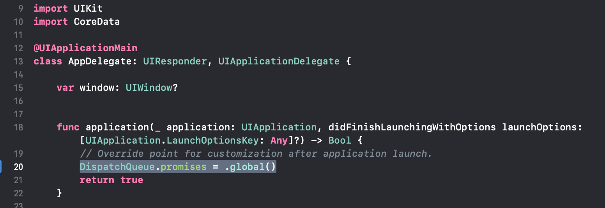

# Quickstart

## Requirement

* [kintone-ios-sdk](https://github.com/kintone/kintone-ios-sdk)
* [promises](https://github.com/google/promises)

## Following below steps

* Create a new project

* Get Carthage by running the bellow command or choose [another installation method](https://github.com/Carthage/Carthage#installing-carthage)

        brew install carthage

* Create [Cartfile](https://github.com/Carthage/Carthage/blob/master/Documentation/Artifacts.md#cartfile) into the ./testSDK folder 

        github "google/promises"
        github "kintone/kintone-ios-sdk"

* Run

        carthage update

* On your application targets’ General settings tab, in the Embedded Binaries section, add Item

        FBLPromises.framework
        Promises.framework
        kintone_ios_sdk.framework

* Build the UI elements

* Connect the UI elements

* Open the ViewController.swift
    * Declare framework

            import UIKit
            import kintone_ios_sdk
            import Promises

    * Init SDK module

            let auth:Auth = Auth()
            var conn:Connection? = nil
            var app:App? = nil

    * Get attribute string

            func getAttributedString(_ htmlString: String) -> NSAttributedString {
                let htmlData = NSString(string: htmlString).data(using: String.Encoding.unicode.rawValue)
                let options = [NSAttributedString.DocumentReadingOptionKey.documentType: NSAttributedString.DocumentType.html]
                let attributedString = try! NSAttributedString(data: htmlData!, options: options, documentAttributes: nil)
                return attributedString
            }

    * Implement *getApp* function

            auth.setPasswordAuth(txtUserName.text!, txtPassword.text!)
            conn = Connection(txtDomain.text!, auth)
            print("domain \(txtDomain.text!)")
            app = App(conn)

            self.app?.getApp(Int(txtAppID.text!)!).then{ response in
                let htmlString = "<html>" +
                    "<head></head>" +
                    "<body><h1>App Infor</h1>" +
                    "<b>App ID: \(response.getAppId()!)</b> " +
                    "<b>App Name: \(response.getName()!)</b> " +
                    "<b>Creared At: \(response.getCreadtedAt()!)</b> " +
                    "<b>Creared By: \(response.getCreator()!.getName()!)</b> " +
                    "</body></head></html>"

                DispatchQueue.main.async {
                    self.txtResult.attributedText = self.getAttributedString(htmlString)
                }
            }.catch { error in
                var htmlString = "<html><head></head><body><h1>Error occur</h1>"

                if type(of: error) == KintoneAPIException.self
                {
                    let err = error as! KintoneAPIException
                    htmlString += "<b>Status code: \(err.getHttpErrorCode()!)</b>" +
                                    "
<b>Message: \(err.getErrorResponse()!.getMessage()!)</b>
"
                } else {
                    htmlString += "
<b>Message: \(error.localizedDescription)</b>
"
                }

                htmlString += "</body></head></html>"

                DispatchQueue.main.async {
                    self.txtResult.attributedText = self.getAttributedString(htmlString)
                }
            }

* Set the promises of dispatch queue to global in the AppDelegate.swift. (Reference: [Default dispatch queue](https://github.com/google/promises/blob/master/g3doc/index.md#default-dispatch-queue) )

* FullCode
    * ViewController Class

            import UIKit
            import kintone_ios_sdk
            import Promises
            class ViewController: UIViewController {

                @IBOutlet weak var txtDomain: UITextField!
                @IBOutlet weak var txtPassword: UITextField!
                @IBOutlet weak var txtUserName: UITextField!
                @IBOutlet weak var txtAppID: UITextField!
                @IBOutlet weak var txtResult: UITextView!
                
                let auth:Auth = Auth.init()
                var conn:Connection? = nil
                var app:App? = nil
                override func viewDidLoad() {
                    super.viewDidLoad()
                    // Do any additional setup after loading the view, typically from a nib.
                    
                }

                @IBAction func getApp(_ sender: Any) {
                    auth.setPasswordAuth(txtUserName.text!, txtPassword.text!)
                    conn = Connection(txtDomain.text!, auth)
                    app = App(conn)
                    
                    self.app?.getApp(Int(txtAppID.text!)!).then{ response in
                        let htmlString = "<html>" +
                            "<head></head>" +
                            "<body><h1>App Infor</h1>" +
                            "<b>App ID: \(response.getAppId()!)</b> " +
                            "<b>App Name: \(response.getName()!)</b> " +
                            "<b>Creared At: \(response.getCreadtedAt()!)</b> " +
                            "<b>Creared By: \(response.getCreator()!.getName()!)</b> " +
                            "</body></head></html>"
                        
                        DispatchQueue.main.async {
                            self.txtResult.attributedText = self.getAttributedString(htmlString)
                        }
                    }.catch { error in
                        var htmlString = "<html><head></head><body><h1>Error occur</h1>"
                        
                        if type(of: error) == KintoneAPIException.self
                        {
                            let err = error as! KintoneAPIException
                            htmlString += "<b>Status code: \(err.getHttpErrorCode()!)</b>" +
                                        "
<b>Message: \(err.getErrorResponse()!.getMessage()!)</b>
"
                        } else {
                            htmlString += "
<b>Message: \(error.localizedDescription)</b>
"
                        }
                        
                        htmlString += "</body></head></html>"
                        
                        DispatchQueue.main.async {
                            self.txtResult.attributedText = self.getAttributedString(htmlString)
                        }
                    }
                }
                
                func getAttributedString(_ htmlString: String) -> NSAttributedString {
                    let htmlData = NSString(string: htmlString).data(using: String.Encoding.unicode.rawValue)
                    let options = [NSAttributedString.DocumentReadingOptionKey.documentType: NSAttributedString.DocumentType.html]
                    let attributedString = try! NSAttributedString(data: htmlData!, options: options, documentAttributes: nil)
                    return attributedString
                }
                
            }

## Run The App
Build and run the iOS App.

After inserting the domain data, credentials and the target Kintone App ID, click on the Get App button.

The iOS App should retrieve the infomation of the specified Kintone App, and display it in the text view.

